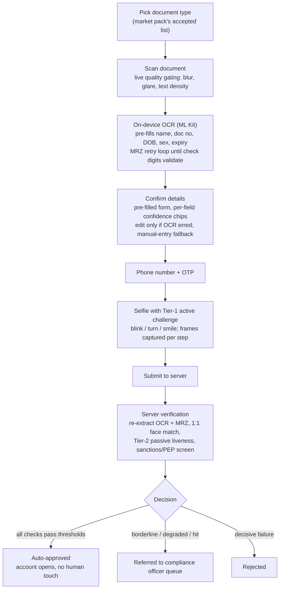
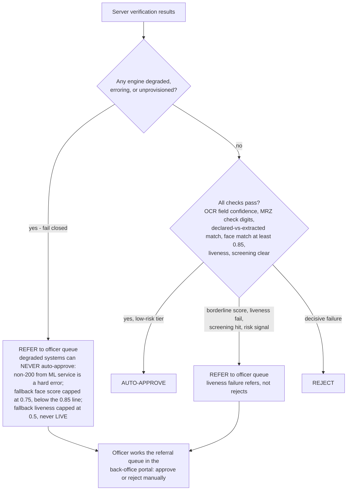

# eKYC Product Overview — Nemo KYC

*Part 1 of the Nemo eKYC documentation set (`docs/ekyc/`) — 2026-08-01. Peers:
[System Architecture](02-system-architecture.md) ·
[Flows & Sequences](03-flows-and-sequences.md) ·
[Component Reference](04-component-reference.md) ·
[Current-State Audit](05-current-state-audit.md) ·
[Level-2 Upgrade Plan](06-level2-upgrade-plan.md) · [Index](README.md).*

## 1. What this product is

**Nemo KYC** is the in-house electronic Know-Your-Customer engine of the Nemo
platform ("neobank in a box" — see [docs/nemo/01-vision.md](../nemo/01-vision.md)).
It closes gap **A2** of the Nemo roadmap
([docs/nemo/02-gap-analysis-and-roadmap.md](../nemo/02-gap-analysis-and-roadmap.md)):
self-service onboarding — phone/ID capture, document OCR, selfie liveness,
sanctions/PEP screening, and risk-tiered auto-approval — so a low-risk applicant can
open an account in under five minutes with zero human touch, replacing today's
officer-driven KYC.

It exists in two commercial frames:

1. **Internal capability** — every Nemo tenant (a tenant *is* a neobank) gets
   self-service onboarding out of the box, configured per market via market-pack
   KYC rule sets.
2. **"Nemo KYC" white-label product (ambition)** — the same stack (scan-first
   onboarding, OCR, face match, liveness, screening, referral queue) offered as a
   per-check API through the public API platform (gap G2), independently
   **certified** (iBeta ISO/IEC 30107-3 PAD) and **calibrated on East African
   faces** — a regional-calibration claim no imported SDK matches
   ([docs/nemo/09-liveness-build-and-certify.md](../nemo/09-liveness-build-and-certify.md)).
   This is planned; the [Current-State Audit](05-current-state-audit.md) tracks what
   is built versus planned.

The founder decision is **in-house first**: the default engine is our own
(`ekyc-ml-service`), with commercial vendors remaining a pluggable secondary option
per client (§7).

## 2. Capabilities catalogue

| Capability | What it does (functionally) | Status |
|---|---|---|
| Document capture + OCR | Extracts full name, document number, date of birth (with per-field confidence) from an ID-document photo. The **MRZ is the trust anchor**: passport TD3 and ID-card TD1 machine-readable zones are parsed with full ICAO 9303 check-digit verification; a checksum-valid MRZ overrides visual-zone OCR. On-device OCR (Google ML Kit) pre-fills the form; the **server always re-extracts and stays authoritative** — no verification decision moves client-side. | Server engine built; scan-first on-device flow per [doc 07](../nemo/07-ocr-first-onboarding.md) |
| 1:1 face match | Compares the document portrait to the live selfie and returns a 0..1 similarity score. Score ≥ 0.85 is the auto-approve line; a degraded (fallback) engine hard-caps its score at 0.75, **below** that line, so a fallback-scored applicant always reaches a human. | Built |
| Liveness (tiered) | Confirms the selfie is a live person, not a photo, screen replay or mask — three tiers, below. | Tier 1+2 approved & building; Tier 3 pluggable |
| Sanctions/PEP screening | Fuzzy name matching (diacritic-stripped, token-sort/token-set, default threshold 0.85) against operator-provisioned sanctions and PEP lists (OFAC, UN, EU consolidated lists in production). Missing lists is a hard error, never a silent pass. | Built (ships demo lists; production lists are an ops drop-in) |
| Risk-tiered decisioning | Combines document, face, liveness and screening results into one of three outcomes (§3): auto-approve, refer to a compliance officer's queue, or reject. **Fail-closed philosophy: a degraded or erroring subsystem can never contribute to an auto-approval** — any engine failure routes the applicant to a human. | Built (referral queue in the back-office portal) |

### The three liveness tiers ([doc 08](../nemo/08-liveness-plan.md))

| Tier | What the applicant/operator sees | Cost | Limit |
|---|---|---|---|
| **1 — Active challenge (on-device)** | A randomized 2–3 step challenge over the selfie camera (blink → turn head → smile), detected by ML Kit face classification; frames captured mid-challenge become the selfie set. Works offline. | Free per check | 2D only — a video replay of someone doing the challenge passes |
| **2 — Passive PAD (server-side)** | Invisible to the applicant: MiniFASNetV2 classifies each selfie frame live vs print/replay attack. Ships **shadow-mode first** (scores logged, nothing decided) because the model's training data skews East-Asian; thresholds are calibrated on real Kenyan traffic before enforcement, with retry-not-reject UX. | Free per check | Not certified; known skin-tone/lighting domain gap until recalibrated |
| **3 — Certified commercial (pluggable)** | An iBeta ISO/IEC 30107-3 PAD Level 2 product (ID R&D IDLive Face, Smile ID SmartSelfie, AWS Rekognition class) behind the same `LivenessProvider` seam, selected per client/market. Escalation on risk signals (large first deposit, device anomaly, borderline Tier-2 score) rather than paying per-check on everything. | Per-check or SDK licence | Vendor dependency; the build-and-certify plan ([doc 09](../nemo/09-liveness-build-and-certify.md)) aims to replace it with our own certified stack |

## 3. The applicant journey

The design principle from [doc 07](../nemo/07-ocr-first-onboarding.md): **the
document is the source of truth and the form is a confirmation screen.**
Registration effort collapses to one scan and one OTP on the happy path.

### Decision outcomes

Key properties:

- **Fail closed.** The ML service fails loudly (4xx/5xx) rather than fabricating
  results; the Go provider treats any non-200 as a hard error and refers the
  applicant to a human. An unprovisioned deployment (missing model files, missing
  screening lists) structurally cannot auto-approve anyone.
- **Referral over rejection** for soft failures — liveness fail and borderline
  scores route to the officer queue, preserving the applicant's chance with a human.
- **Provider-agnostic decisioning.** The onboarding flow, tiering and referral
  queue do not change when the underlying eKYC provider changes (§7).

## 4. Market & document matrix

Launch matrix from [doc 07](../nemo/07-ocr-first-onboarding.md) — Kenya and
Ethiopia, per the Nemo market sequencing:

| Market | Document | Key identifiers & format | On-device OCR strategy | Notes |
|---|---|---|---|---|
| KE | National ID | 7–9 digit ID number | English labels/values — full field extraction (label-anchored) | Server extraction profile exists |
| KE | Passport | **TD3 MRZ** (two 44-char lines) | MRZ only — pure Latin, checksum-verifiable; visual zone as fallback | Cheapest, highest-confidence path; ships first |
| ET | Fayda national ID | **FAN, 16-digit** (number printed on card); FIN out of scope for v1 | Bilingual card — extract the **English/Latin half** on-device (ML Kit has no Amharic support); server keeps the full image | Only genuinely new extraction work |
| ET | Passport | **TD3 MRZ** | Same as KE passport — free once MRZ ships | |

MRZ is the great equalizer: for passports the visual zone is not scraped on-device
at all — parse the two lines, verify check digits, done. Both KE and ET passports
are e-passports; an NFC chip read (true authenticity check) is a natural later
upgrade using the BAC key the MRZ already yields (planned, out of current scope).

## 5. Personas

| Persona | Relationship to the product |
|---|---|
| **Applicant** | The end customer opening an account on the tenant's app. Sees: doc-type picker, camera scan, pre-filled confirmation screen, OTP, selfie challenge, and either an instant open or a "under review" state. |
| **Compliance officer** | Works the **referral queue in the back-office portal** — every referred application lands here with the extracted fields, scores and reasons; the officer approves or rejects manually. The queue spans tenants for staff with the cross-tenant override. |
| **Ops** | Owns deploy-time provisioning: face/liveness ONNX model files (drop-ins; `/health` reports which engine is live), and daily-refresh sanctions/PEP list files (demo data must be replaced in production; `/health` exposes entry counts for staleness alerting). |
| **Per-tenant operator** | The neobank operator (Nemo's customer). Chooses the eKYC/liveness provider for their deployment (§7), the market pack (which sets accepted document types and KYC rules), and — under the white-label ambition — may consume Nemo KYC itself as a per-check API. |

## 6. Regulatory context

| Jurisdiction | Requirement | Implication for the product |
|---|---|---|
| **Kenya — CBK** | CBK guidance permits biometric remote onboarding; no statute names a specific PAD certification. | Certified PAD is bank-partner/auditor due diligence, not law. |
| **Kenya — Data Protection Act / ODPC** | A **DPIA is required** before selfie/liveness/face-match processing at scale; the ODPC is the regulator. | DPIA artifact must exist before production liveness enforcement in Kenya. On-prem/in-house biometric processing (no images leaving the deployment) strengthens the DPIA position. |
| **Ethiopia — NBE / Fayda** | NBE has mandated **Fayda digital ID for banking** (phased 2025→2026), with onboarding through **VeriFayda 2** (national eKYC via EthSwitch). | ET liveness/1:1 likely routes through the national platform: VeriFayda is treated as another provider behind the same seam (§7). Integration scoping is a separate design doc when the ET pilot starts. |
| **Bank-partner bar** | **iBeta ISO/IEC 30107-3 PAD Level 1/2** is the de-facto certification banks and auditors ask for. | Level 1: zero spoofs through (~900 presentations, 6 attack species). Level 2 adds 3D mask attacks at APCER ≤1%. The build-and-certify path is the subject of the [Level-2 Upgrade Plan](06-level2-upgrade-plan.md) and [doc 09](../nemo/09-liveness-build-and-certify.md). |

## 7. Provider strategy

**In-house first, pluggable always.** The Go compliance-service selects the eKYC
implementation by name from a provider registry via a single env var
(`EKYC_PROVIDER=inhouse` is the default). Swapping a client onto a commercial
vendor is: implement the provider interface, register it, set the env var — the
onboarding flow, risk tiering and referral queue are provider-agnostic, and every
provider must fail closed on errors like the in-house one.

| Provider | Class | Role |
|---|---|---|
| **In-house (`ekyc-ml-service`)** | Tesseract OCR + ICAO 9303 MRZ, YuNet/SFace face match, MiniFASNetV2 passive PAD, fuzzy-match screening | Default for all markets; the asset behind the white-label ambition |
| **Smile ID / Veriff class** | Full-KYC commercial vendors (Smile ID: iBeta L2, Flutter SDK, Africa pricing ~$0.30–1.00/check, Kenyan ID-registry lookups) | Pluggable per client where a certified end-to-end vendor is demanded |
| **ID R&D IDLive Face** | iBeta L1+L2 single-image passive liveness, on-prem SDK | Tier-3 liveness option; keeps biometrics on-prem (helps the ODPC/DPIA argument) |
| **AWS Rekognition Face Liveness** | Managed, ~$0.015/check, iBeta-benchmarked (not certified) | Budget Tier-3 fallback, not flagship |
| **VeriFayda 2** | Ethiopia's national eKYC platform (EthSwitch) | The ET provider where the NBE Fayda mandate applies — same seam |
| **Bridge SDK (MiniAiLive/KBY-AI class)** | iBeta-L2 on-prem SDK, ~$2–8k/yr | Planned Stage-0 stopgap so "Level 2 certified" is claimable while the in-house stack is built and certified |

The liveness seam mirrors this: a `LivenessProvider` interface
({frames} → {liveScore, decision, provider, auditRef}) lets Tier 3 products drop
in server-side with zero mobile-app changes, escalated on risk signals rather than
invoked on every check.

---

*Next: [02-system-architecture.md](02-system-architecture.md) for how these
capabilities are realised across the mobile app, BFF, compliance-service and
ekyc-ml-service; [05-current-state-audit.md](05-current-state-audit.md) for the
precise built-vs-planned status of everything named above.*
