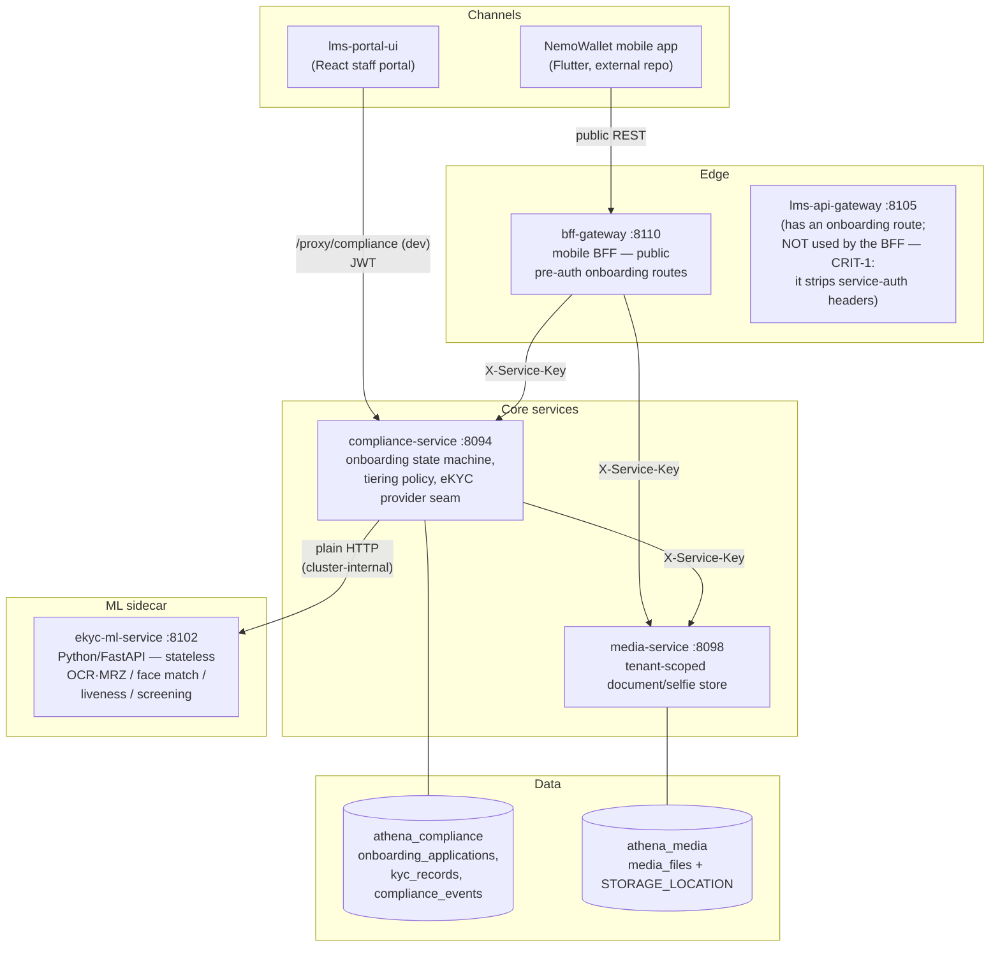
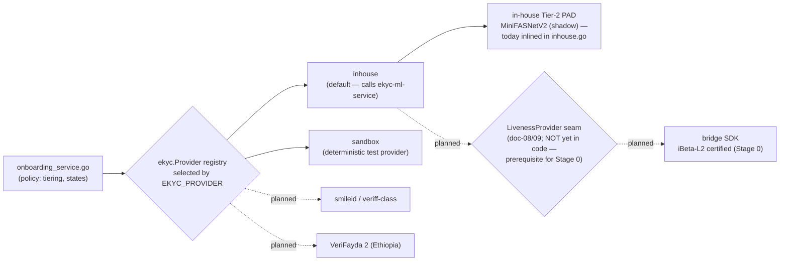
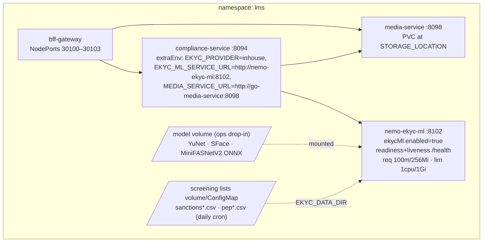
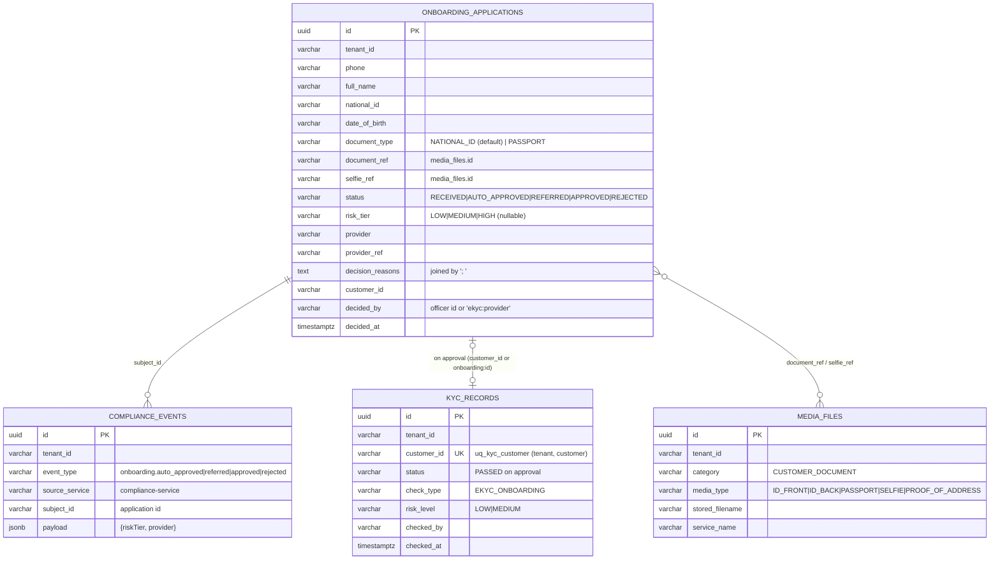

# eKYC System Architecture

*Part of the [Nemo eKYC technical documentation](README.md). 2026-08-01. Technical
architecture of the self-service onboarding & eKYC subsystem (gap A2): services,
boundaries, deployment topology, data model and configuration. Sequence-level detail
is in [03 — Flows & Sequences](03-flows-and-sequences.md); ML-engine internals in
[04 — Component Reference](04-component-reference.md).*

---

## 1. System context

The eKYC subsystem spans two channels (mobile applicant, staff portal), three backend
services (bff-gateway, compliance-service, media-service), one ML sidecar
(ekyc-ml-service) and two databases. It is multi-tenant end to end — a tenant is a
neobank, and every row and media object is tenant-scoped.

Trust boundaries:

- **Public → BFF**: the four `/api/v1/mobile/onboarding/*` routes are deliberately
  pre-auth (an applicant has no account yet). Upload size is capped at 12 MiB; media
  types whitelisted (`ID_FRONT`, `ID_BACK`, `PASSPORT`, `SELFIE`, `PROOF_OF_ADDRESS`).
- **Service ↔ service**: `X-Service-Key` (= `LMS_INTERNAL_SERVICE_KEY`) with
  `X-Service-Tenant` / `X-Service-User` stamping via `auth.ServiceKeyTransport`;
  service callers get roles `[SERVICE, ADMIN]`.
- **compliance → ekyc-ml**: plain HTTP, **no auth** — the sidecar port must never be
  exposed outside the cluster network.
- **Portal → compliance**: JWT; the decide endpoints additionally require
  `compliance.decide` (fallback roles `ADMIN`, `MANAGER`).

## 2. Component responsibilities

| Component | Responsibility | Key code |
|---|---|---|
| bff-gateway | Public onboarding facade: media upload relay, submission relay, status polling with `nextStep` hints, market-pack document list | `internal/bff/gateway/` (handler/service/client) |
| compliance-service | Onboarding state machine (`RECEIVED → AUTO_APPROVED \| REFERRED → APPROVED \| REJECTED`), market-pack document validation, tiering policy, provider registry, KYC record upsert, compliance event trail | `internal/compliance/service/onboarding_service.go`, `internal/compliance/ekyc/` |
| ekyc-ml-service | Stateless verification engine: document extract (OCR + MRZ), 1:1 face match, passive liveness (PAD), sanctions/PEP screening | `ekyc-ml-service/` — see [04](04-component-reference.md) |
| media-service | Tenant-scoped binary store for documents/selfies; download served only to matching tenant | `internal/media/` |
| lms-portal-ui | Officer referral queue: list/filter `REFERRED`, approve/reject with mandatory reason, cross-tenant view (`tenantId=*`) | `src/pages/OnboardingReferralsPage.tsx`, `src/services/onboardingService.ts` |

### 2.1 Provider seams (pluggability)

Two registries decouple policy from vendors:

- `ekyc.Provider` = `Name()` + `Verify(ctx, Request) (Result, error)`
  (`internal/compliance/ekyc/ekyc.go:53`). Registered implementations: `sandbox`
  (built-in) and `inhouse` (wired in `cmd/compliance-service/main.go`). `EKYC_PROVIDER`
  selects by lowercased name; empty → `sandbox`; unknown → startup error.
- `ekyc.Result` carries: `DocumentVerified`, `LivenessPassed`, `FaceMatchScore`,
  `SanctionsHit`, `PEPHit`, `ProviderRef`, plus liveness observability
  (`LivenessScore` ∈ [0,1] or −1, `LivenessMode` ∈ `"" | shadow | shadow-error | enforce`).
- The onboarding flow, tiering and referral queue are provider-agnostic — swapping
  vendors is one env var per deployment/tenant.

## 3. Deployment topology

### 3.1 docker-compose (dev/staging)

`docker-compose.go.yml` overlays the base stack:

| Compose service | Image/build | Container port | Host port | Notes |
|---|---|---|---|---|
| `go-compliance-service` | monorepo build, `SERVICE: compliance-service` | 8094 | 28094 | `EKYC_PROVIDER=${EKYC_PROVIDER:-inhouse}`; `depends_on: ekyc-ml-service (healthy)` |
| `go-media-service` | monorepo build | 8098 | 28098 | `DB_NAME: athena_media` |
| `ekyc-ml-service` | `build.context: ./ekyc-ml-service` | 8102 | 28102 | healthcheck `GET /health` |
| `go-bff-gateway` | monorepo build | 8110 | 28110 + NodePort 30100 | `COMPLIANCE_SERVICE_URL`, `MEDIA_SERVICE_URL` direct (bypasses public gateway) |
| `lms-api-gateway` | monorepo build | 8105 | 28105 | public `/lms/api/v1/onboarding/` route exists but is not the mobile path |

Portal dev proxy: `vite.config.ts` maps `/proxy/compliance` → `http://localhost:28094`.

### 3.2 Kubernetes (Helm, `deploy/helm/nemo/`)

Disabling the sidecar for a vendor-based tenant: `ekycMl.enabled=false` +
`EKYC_PROVIDER=<vendor>`.

### 3.3 Scaling & operational properties

- **ekyc-ml-service is stateless** — horizontal scaling is trivial; the heavy call is
  OCR (Tesseract, CPU-bound). Models are ~3 MB total; no GPU anywhere.
- **compliance-service** holds the only durable onboarding state; migrations run at
  boot (`db.MigrateGate`, `file://migrations/compliance`).
- **Timeouts**: engine client 60 s, media client 30 s. Engine responses capped at
  1 MiB read; media downloads capped at 20 MiB.
- **Observability**: liveness shadow scores are recorded in `decision_reasons`
  (`LIVENESS[mode=… score=… frames=…]`) for threshold calibration; `/health` on the
  sidecar reports which engines are live (`faceEngine`, `livenessEngine`, list counts).

## 4. Data model

Two databases, no shared tables. All rows carry `tenant_id`.

Integrity rules worth knowing:

- `uq_onboarding_open` — partial unique index on `(tenant_id, national_id)` where
  `status IN ('RECEIVED','REFERRED')`: one open application per identity per tenant;
  violation surfaces as a `BusinessError`.
- `selfie_frame_refs` is **request-only** (no column): Tier-1 challenge frames feed
  the liveness call and surface only in the `LIVENESS[…]` reason string.
- Compliance events are **DB rows only** (audit trail); the onboarding path publishes
  nothing to RabbitMQ — event-trail write failures are logged, never fatal
  ("the decision stands even if the trail write fails").
- Media downloads are tenant-filtered in SQL (`WHERE id = $1 AND tenant_id = $2`);
  the service key's `X-Service-Tenant` decides which tenant a service call reads.

## 5. Configuration reference

### 5.1 compliance-service (Go)

| Env var | Default | Effect |
|---|---|---|
| `EKYC_PROVIDER` | `sandbox` (compose/Helm set `inhouse`) | provider registry selection. ⚠️ the `sandbox` default auto-approves (score 0.97) — every production deploy target must pin `inhouse` or a vendor; all three current targets do |
| `EKYC_ML_SERVICE_URL` | — (required for inhouse) | sidecar base URL; empty → Verify fails closed |
| `MEDIA_SERVICE_URL` | — (required for inhouse) | media base URL; empty → Verify fails closed |
| `LMS_INTERNAL_SERVICE_KEY` | compose: `athena-internal-key` | service-to-service auth |
| `LIVENESS_ENFORCE` | unset → **shadow mode** | exactly `"true"` enables enforcement (`"1"`/`"TRUE"` do not) |
| `MARKET_PACK` / `MARKET_PACK_DIR` | `KE` | market pack (accepted doc types, number patterns, OCR profiles) |
| `PORT` / `DB_NAME` | 8094 / `athena_compliance` | service basics |

### 5.2 Thresholds (compile-time, not env-tunable today)

| Threshold | Value | Where | Used for |
|---|---|---|---|
| Face-match auto-approve | **0.85** | `onboarding_service.go:22` (`faceMatchThreshold`) | tiering |
| Field-confidence floor | **0.60** | `inhouse.go` (`defaultMinFieldConfidence`) | document verification |
| Name-match threshold | **0.75** | `inhouse.go` (`defaultNameMatchThreshold`) | declared vs extracted name |
| Liveness threshold | **0.5** (placeholder) | `inhouse.go` (`defaultLivenessThreshold`) | enforce mode only; calibrating in shadow |
| Max liveness frames | **5** | `inhouse.go` / `api/face.py` | frame cap both sides |
| Screening threshold | **0.85** | `engine/screening.py` | sanctions/PEP fuzzy match |

### 5.3 ekyc-ml-service (Python)

See [04 §5](04-component-reference.md#5-configuration): `EKYC_DATA_DIR`,
`FACE_DETECTOR_MODEL`, `FACE_EMBEDDER_MODEL`, `FACE_LIVENESS_MODEL`.

## 6. Known architectural debts

Tracked in detail in [05 — Current-State Audit](05-current-state-audit.md):

1. **Thresholds are compile-time constants** — per-tenant/per-market tuning (a market
   pack concern) requires a code change today.
2. **CRIT-1**: the public lms-api-gateway strips service-auth headers, which is why
   the mobile BFF calls compliance-service directly; the gateway's onboarding route
   is effectively vestigial for this flow.
3. **Liveness threshold uncalibrated** — 0.5 is a documented placeholder pending
   shadow-mode data; enforcement must not be enabled before calibration
   ([06 — Upgrade Plan](06-level2-upgrade-plan.md)).
4. **No RabbitMQ events from onboarding** — downstream consumers (e.g. notification
   templates for "application received/approved") would need the compliance event
   publisher wired into `OnboardingService`.
5. **Sidecar port is unauthenticated by design** — network policy must guarantee it
   is cluster-internal.
