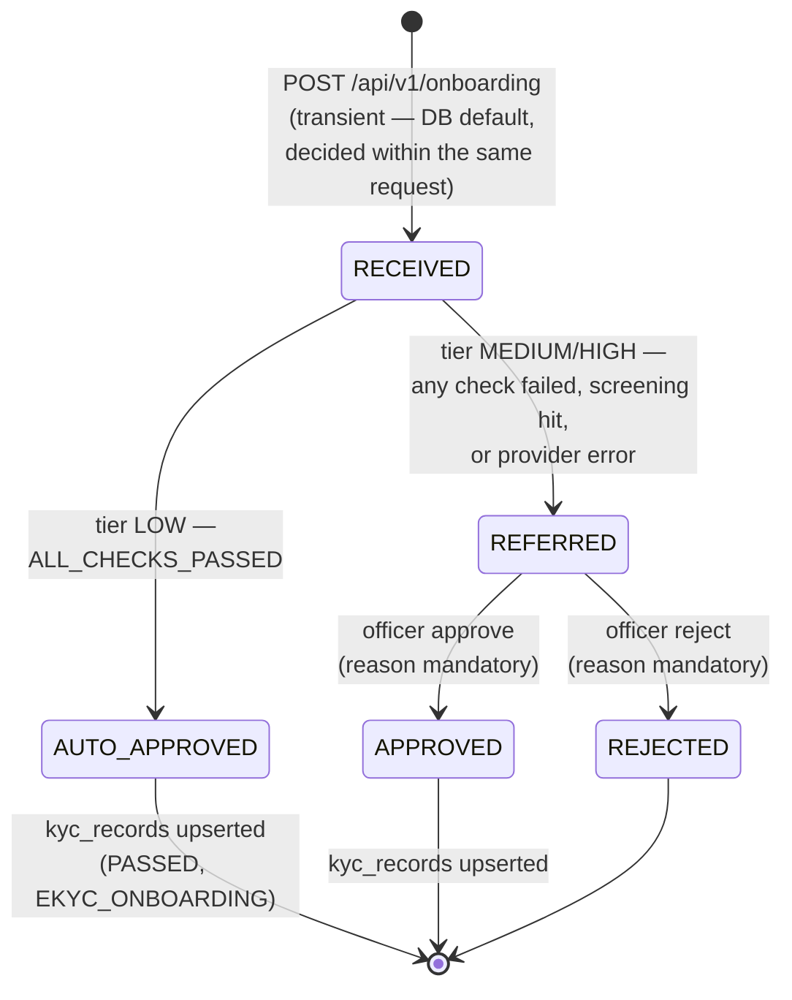
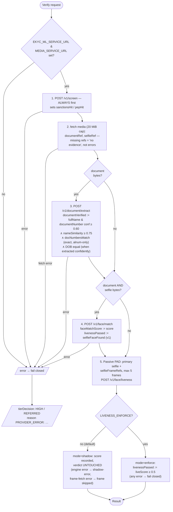
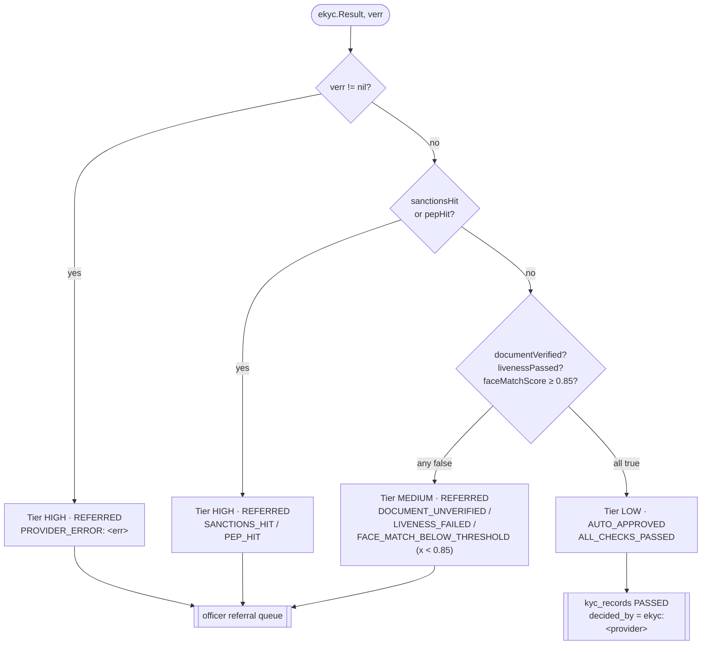
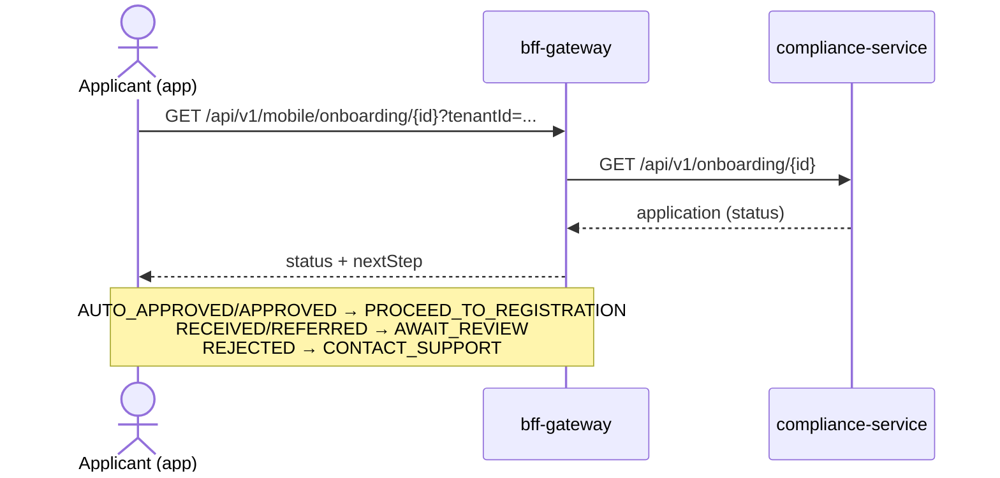

# eKYC Flows & Sequence Diagrams

*Part of the [Nemo eKYC technical documentation](README.md). 2026-08-01. Every
runtime path of the onboarding & eKYC subsystem: end-to-end sequences, the
verification pipeline, the tiering decision, the officer review loop and the failure
paths. Endpoint paths, state names and thresholds are taken from the code
(compliance-service, bff-gateway, media-service, ekyc-ml-service) as of this commit.*

---

## 1. Application state machine



- v1 **never auto-rejects** — a machine can approve, only a human can reject.
- One open application per identity: partial unique index `uq_onboarding_open` on
  `(tenant_id, national_id)` for statuses `RECEIVED`/`REFERRED`.
- Only `REFERRED` applications can be decided; deciding anything else returns a
  `BusinessError`.

## 2. End-to-end onboarding (happy path, auto-approve)

```mermaid
sequenceDiagram
    autonumber
    actor A as Applicant (mobile app)
    participant B as bff-gateway :8110<br/>(public, pre-auth)
    participant M as media-service :8098
    participant C as compliance-service :8094
    participant E as ekyc-ml-service :8102

    Note over A: scan document → on-device OCR pre-fill →<br/>confirm → OTP → selfie challenge (frames)
    A->>B: GET /api/v1/mobile/onboarding/documents
    B-->>A: accepted doc types (market pack)
    loop each file (doc, selfie, challenge frames)
        A->>B: POST /api/v1/mobile/onboarding/media<br/>(multipart, ≤12 MiB, mediaType whitelist)
        B->>M: POST /api/v1/media/upload (X-Service-Key)
        M-->>B: media row (id)
        B-->>A: 201 {mediaRef}
    end
    A->>B: POST /api/v1/mobile/onboarding<br/>{fullName, nationalId, phone, documentType,<br/>documentRef, selfieRef, selfieFrameRefs[], tenantId}
    B->>C: POST /api/v1/onboarding (X-Service-Key, X-Service-Tenant)
    C->>C: validate required fields;<br/>market-pack docType + number-pattern gate
    C->>E: POST /v1/screen {fullName}
    E-->>C: {sanctionsHit:false, pepHit:false}
    C->>M: GET /api/v1/media/download/{documentRef}
    C->>M: GET /api/v1/media/download/{selfieRef}
    C->>E: POST /v1/document/extract (file, doc_type, profile)
    E-->>C: fields{value,confidence} + mrz
    C->>E: POST /v1/face/match (document, selfie)
    E-->>C: {score: 0.93, engine: sface}
    C->>E: POST /v1/face/liveness (≤5 frames)
    E-->>C: {liveScore, label, model}<br/>(shadow: logged, not enforced)
    C->>C: tierDecision → LOW / AUTO_APPROVED<br/>(doc verified ∧ liveness ∧ score ≥ 0.85 ∧ no hits)
    C->>C: INSERT onboarding_applications;<br/>UPSERT kyc_records (PASSED, EKYC_ONBOARDING);<br/>INSERT compliance_events (onboarding.auto_approved)
    C-->>B: 201 application (AUTO_APPROVED, tier LOW)
    B-->>A: 201 + nextStep: PROCEED_TO_REGISTRATION
```

## 3. Verification pipeline inside `inhouse.Verify`

Exact order and error semantics (`internal/compliance/ekyc/inhouse.go`):



## 4. Tiering decision

`tierDecision` (`onboarding_service.go`) evaluates in strict order — screening hits
short-circuit the document/biometric checks:



When a PAD call ran, an observability reason is appended regardless of outcome:
`LIVENESS[mode=<shadow|shadow-error|enforce> score=<%.2f> frames=<n>]` — this is the
shadow-mode calibration data source for the
[Level-2 upgrade plan](06-level2-upgrade-plan.md).

## 5. Officer review loop (referral queue)

```mermaid
sequenceDiagram
    autonumber
    actor O as Compliance officer
    participant P as lms-portal-ui<br/>/onboarding-referrals
    participant C as compliance-service :8094

    O->>P: open Onboarding Referrals (tab REFERRED)
    P->>C: GET /api/v1/onboarding/?status=REFERRED&page=0&size=50&tenantId=*
    Note right of C: staffTenant: ?tenantId only honored for<br/>ADMIN / MANAGER / SERVICE;<br/>"*" → unscoped (all tenants);<br/>others pinned to own tenant
    C-->>P: applications (created_at DESC)
    O->>P: open application → review decision_reasons<br/>(split on "; ")
    alt approve
        O->>P: approve + reason (mandatory)
        P->>C: POST /api/v1/onboarding/{id}/approve?tenantId=<app tenant> {reason}
        Note right of C: requires compliance.decide<br/>(fallback ADMIN/MANAGER);<br/>only REFERRED may be decided
        C->>C: status → APPROVED; reasons += "; OFFICER: <reason>";<br/>UPSERT kyc_records (PASSED);<br/>INSERT compliance_events (onboarding.approved)
        C-->>P: 200 application
    else reject
        O->>P: reject + reason (mandatory)
        P->>C: POST /api/v1/onboarding/{id}/reject?tenantId=... {reason}
        C->>C: status → REJECTED; event onboarding.rejected<br/>(no kyc_records write)
        C-->>P: 200 application
    end
```

Meanwhile the applicant polls:



## 6. Failure paths (fail-closed catalogue)

| Failure | Where it surfaces | Outcome for the applicant |
|---|---|---|
| Sidecar down / non-200 / undecodable image | `inhouse.Verify` error | Tier HIGH, `REFERRED`, `PROVIDER_ERROR: …` — human decides |
| Tesseract or screening lists missing | sidecar `503` | same as above (fail closed) |
| Face models missing | fallback engine, score ≤ 0.75 | `FACE_MATCH_BELOW_THRESHOLD` → `REFERRED` (can never auto-approve) |
| Liveness model missing | label `UNKNOWN`, score ≤ 0.5 | shadow: no effect; enforce: `LIVENESS_FAILED` → `REFERRED` |
| Media fetch error (either ref) | `inhouse.Verify` error | `PROVIDER_ERROR` → `REFERRED` |
| Challenge-frame fetch error | skipped (shadow) / error (enforce) | shadow unaffected / `PROVIDER_ERROR` when enforcing |
| Sanctions or PEP hit | screening, checked first | Tier HIGH → `REFERRED` (`SANCTIONS_HIT`/`PEP_HIT`) |
| docType not accepted by market pack / number-pattern mismatch | `Submit` validation | `400 Bad Request` before any verification |
| Duplicate open application | `uq_onboarding_open` | `BusinessError` — "an open onboarding application already exists" |
| Compliance-event trail write fails | logged only | decision stands (audit trail is best-effort) |

Design invariant across every row: **no degraded component can produce an
auto-approval**. Missing models cap below thresholds; missing binaries and lists are
hard 5xx; hard errors become `REFERRED`, never `APPROVED`.

## 7. Media upload flow (detail)

```mermaid
sequenceDiagram
    autonumber
    actor A as Applicant (app)
    participant B as bff-gateway
    participant M as media-service

    A->>B: POST /api/v1/mobile/onboarding/media<br/>multipart: file, mediaType, tenantId?
    B->>B: cap 12 MiB; mediaType ∈ {ID_FRONT, ID_BACK,<br/>PASSPORT, SELFIE, PROOF_OF_ADDRESS};<br/>category := CUSTOMER_DOCUMENT
    B->>M: POST /api/v1/media/upload<br/>(streamed via io.Pipe, X-Service-Key,<br/>ServiceName mobile-gateway)
    M->>M: store to STORAGE_LOCATION;<br/>INSERT media_files (tenant-scoped)
    M-->>B: 200 media row
    B-->>A: 201 {mediaRef, mediaType, fileName}
    Note over M: later: compliance-service downloads by id —<br/>SQL enforces id AND tenant_id match
```

## 8. Cross-references

- Engine internals of steps 3–5 (OCR/MRZ, face match, PAD): [04 — Component Reference](04-component-reference.md)
- Why liveness is shadow-mode and what replaces it: [06 — Level-2 Upgrade Plan](06-level2-upgrade-plan.md)
- Which of these paths are fully built vs partial: [05 — Current-State Audit](05-current-state-audit.md)
