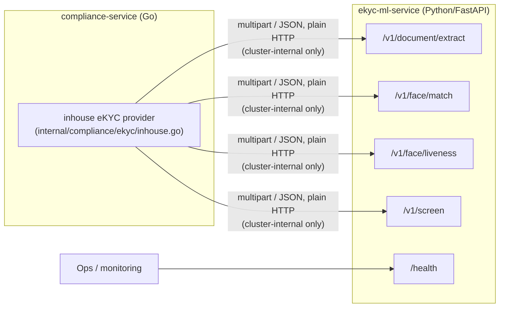
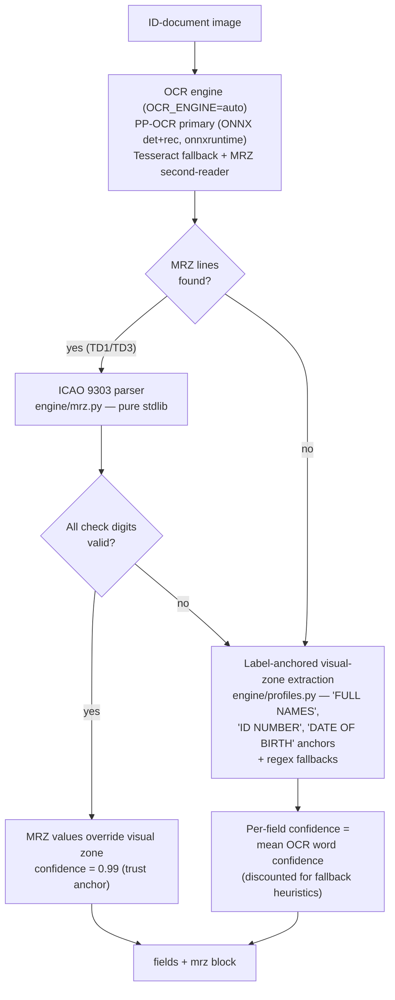
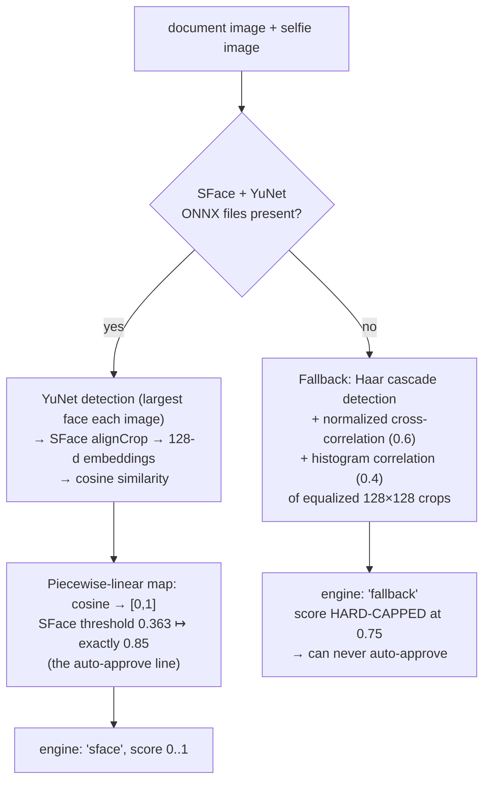
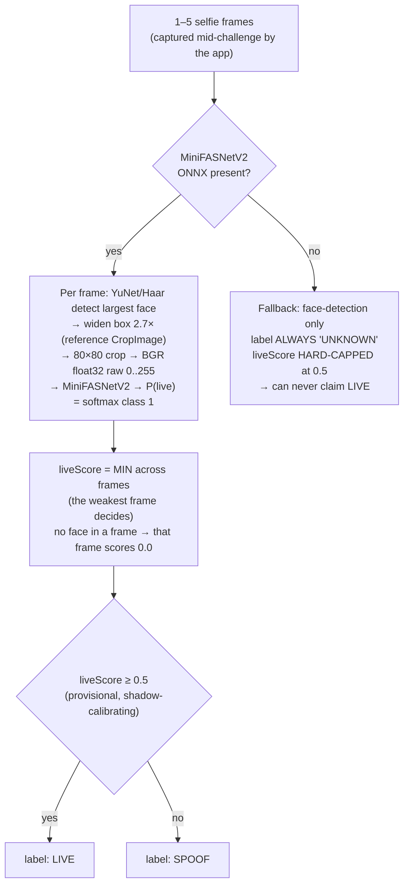

# eKYC Component Reference — `ekyc-ml-service`

*Part of the [Nemo eKYC technical documentation](README.md). Covers the Python/FastAPI
verification engine in depth: every endpoint, every model, every threshold, and the
fail-safe design that makes an unprovisioned or degraded deployment unable to
fabricate a verification pass.*

---

## 1. Role in the system

`ekyc-ml-service` is the in-house verification engine for the Nemo platform (gap A2).
It is a **stateless sidecar**: it holds no database, stores no images, and keeps no
per-applicant state. `compliance-service` (Go) calls it over plain HTTP inside the
cluster network when `EKYC_PROVIDER=inhouse` (the default). It mirrors the
`fraud-ml-service` sidecar pattern — FastAPI app, slim Docker image, never exposed
publicly, no auth on the internal port.



Design rule: **fail loudly, fail closed.** The service returns 4xx/5xx rather than
fabricated results — no OCR binary → `503`, no screening lists → `503`, undecodable
image → `422`. The Go provider treats any non-200 as a hard error and the onboarding
flow refers the applicant to a human.

## 2. API surface

| Endpoint | Request | Response |
|---|---|---|
| `POST /v1/document/extract` | multipart `file` (ID-document image) | `fields` map (`fullName`, `documentNumber`, `dateOfBirth`), each `{value, confidence}`; `mrz` block when a machine-readable zone was found (per-check-digit results + overall `valid`) |
| `POST /v1/face/match` | multipart `document` + `selfie` | `{engine, score (0..1), documentFaceFound, selfieFaceFound}` |
| `POST /v1/face/liveness` | multipart, 1–5 `frame` parts | `{liveScore (0..1, min across frames), label (LIVE\|SPOOF\|UNKNOWN), perFrame[{score, faceFound}], model}` |
| `POST /v1/screen` | JSON `{"fullName": "...", "threshold": 0.85?}` | `{sanctionsHit, pepHit, matches[], listsLoaded}` |
| `GET /health` | — | engine availability: OCR present, `faceEngine: sface\|fallback`, `livenessEngine: minifasnet_v2\|fallback`, screening-list entry counts |

## 3. Pipeline internals

### 3.1 Document extraction (OCR + MRZ)



- **OCR engines** (`OCR_ENGINE=auto|ppocr|tesseract`, default `auto`): **PP-OCR
  primary** — PaddleOCR's det/rec networks as plain ONNX via onnxruntime
  (`engine/ppocr.py`, RapidOCR-style, ~14 MB, checksummed at image build), markedly
  better than Tesseract on real phone photos (validated on rotated/noisy/low-contrast
  synthetic IDs) — with **Tesseract as fallback** and as a second MRZ-charset reading
  appended to PP-OCR text. No engine available → 503 (no capped fallback for OCR —
  fabricated fields have no safe cap). Either way the **MRZ is the trust anchor**,
  not the visual zone.
- **MRZ parsing** (`engine/mrz.py`, 191 lines, zero dependencies): TD3 (passports,
  2×44 chars) and TD1 (ID cards, 3×30 chars) with full ICAO 9303 check-digit
  verification (7-3-1 weighted mod-10; a `<` check digit accepted only for the
  all-filler optional field, per 9303). A checksum-valid MRZ **overrides** visual-zone
  OCR at confidence 0.99.
- **Visual-zone profiles** (`engine/profiles.py`): label-anchored line matching tuned
  for Kenyan-ID-class layouts, regex fallbacks per field. Extraction profiles keyed by
  (market, docType) are the doc-07 WS-1 extension point (KE ID exists; passport
  MRZ-only and ET Fayda profiles planned).

### 3.2 Face match (1:1 verification)



- **Models**: YuNet (`face_detection_yunet_2023mar.onnx`) + SFace
  (`face_recognition_sface_2021dec.onnx`), ~2 MB combined, OpenCV model zoo, run by
  `opencv-python-headless` — no GPU, no extra ML framework. Inputs are bounded to a
  1600 px long side before detection (YuNet degrades on very large images).
- **Score mapping** (`engine/facematch.py:72`): SFace's published cosine verification
  threshold (0.363) is pinned to 0.85 so the Go side reasons only in [0,1] — same-person
  pairs land above the auto-approve line, different-person pairs below; cosine ≥ 0.6
  maps to ~1.0.
- **Degradation contract**: without model files the deterministic fallback caps at
  **0.75 < 0.85**, so a fallback-scored applicant always reaches a human. The `engine`
  field in every response and `/health` (`faceEngine`) make the active path observable.

### 3.3 Passive liveness (Tier-2 PAD)



- **Model**: MiniFASNetV2 (MiniVision Silent-Face-Anti-Spoofing, Apache-2.0, ~600 KB
  ONNX) on the same OpenCV `dnn` stack. Preprocessing follows the reference
  implementation exactly: 2.7× widened crop, 80×80, **raw 0–255 BGR float32** (the
  reference `ToTensor` does not divide by 255), softmax **index 1 = live**; an export
  that already ends in softmax is detected (outputs sum ≈ 1) and not re-normalized.
- **Enforcement lives Go-side** (`LIVENESS_ENFORCE`, shadow mode by default): the
  engine only reports; the compliance-service decides. See
  [03 — flows](03-flows-and-sequences.md) and doc-08.
- **Known limitation (why the upgrade plan exists)**: MiniFASNetV2 is MiniVision's
  *demo tier*; training data skews East-Asian, with documented false rejects in low
  light and elevated risk on darker skin tones. This is the direct motivation for the
  NLD-EA data campaign and the Level-2 plan — see
  [06 — upgrade plan](06-level2-upgrade-plan.md).

### 3.4 Sanctions / PEP screening

- **Matcher** (`engine/names.py`, mirrored in the Go provider for
  declared-vs-extracted comparison): NFKD diacritic stripping + casefold +
  token-sort / token-set similarity; default threshold **0.85**.
- **Lists** (`engine/screening.py`): loads every `sanctions*.csv` / `pep*.csv` in
  `EKYC_DATA_DIR`. CSV shape `id,name,aliases,country,program`, aliases `;`-separated.
  The shipped `sanctions_demo.csv` / `pep_demo.csv` are **fictional development data**;
  production must drop in real consolidated lists on a daily ops cron:
  OFAC SDN + Consolidated, UN Security Council Consolidated, EU Consolidated, and a
  commercial/curated PEP feed. `listsLoaded` (per call) and `/health` entry counts
  exist so ops can alert on stale or empty data.

## 4. Fail-safe matrix

The service is engineered so that **no missing dependency can ever manufacture a pass**:

| Degraded condition | Behaviour | Worst outcome |
|---|---|---|
| Tesseract binary missing | `503` on `/v1/document/extract` | hard error → human referral |
| Face ONNX models missing | fallback engine, score ≤ **0.75** | below 0.85 → never auto-approves |
| Liveness ONNX missing | fallback, label `UNKNOWN`, score ≤ **0.5** | can never claim `LIVE` |
| OpenCV 5 wheel without Haar cascade | "no face" → `UNKNOWN` | fail-safe, never a fabricated LIVE |
| Screening lists missing/empty | `503` on `/v1/screen` | hard error → human referral |
| Only `*_demo.csv` lists loaded + `EKYC_ALLOW_DEMO_LISTS=false` | `503` on `/v1/screen`; `/health` `503` with `screeningListsMode: demo-only` | fictional lists can never report a clean screen in production |
| Engine mode ≠ `EXPECTED_FACE_ENGINE` / `EXPECTED_LIVENESS_ENGINE` (when set) | `/health` `503` with a `degraded` list naming each mismatch | k8s readiness keeps the silently-degraded pod out of the Service |
| Model download succeeds with wrong SHA-256 (image build) | **build fails** (`Dockerfile` pinned checksums) | a tampered model can never ship; offline builds still fall back |
| Undecodable image | `422` | hard error → human referral |
| Any non-200 seen by the Go provider | treated as hard failure | applicant referred to a human (fail closed) |

## 5. Configuration

| Env var | Default | Purpose |
|---|---|---|
| `EKYC_DATA_DIR` | packaged `data/` | screening-list directory (mount a volume/ConfigMap in production) |
| `OCR_ENGINE` | `auto` | `auto` (PP-OCR if provisioned, else Tesseract) \| `ppocr` \| `tesseract` |
| `PPOCR_DET_MODEL` | `/app/models/ppocr_det.onnx` | PP-OCR detection ONNX (checksummed build download) |
| `PPOCR_REC_MODEL` | `/app/models/ppocr_rec.onnx` | PP-OCR recognition ONNX |
| `PPOCR_REC_DICT` | `/app/models/ppocr_keys_en.txt` | recognition charset (includes `<` — MRZ-capable) |
| `EKYC_ALLOW_DEMO_LISTS` | `true` (allow) | `false` → demo-only lists fail closed: `503` on `/v1/screen`, degraded `/health`. Helm sets `false` (`ekycMl.allowDemoLists`); compose leaves the dev default |
| `FACE_DETECTOR_MODEL` | `/app/models/face_detection_yunet_2023mar.onnx` | YuNet ONNX |
| `FACE_EMBEDDER_MODEL` | `/app/models/face_recognition_sface_2021dec.onnx` | SFace ONNX |
| `FACE_LIVENESS_MODEL` | `/app/models/minifasnet_v2.onnx` | MiniFASNetV2 PAD ONNX |
| `EXPECTED_FACE_ENGINE` | unset (don't care) | `sface`\|`fallback` — `/health` `503`s on mismatch (readiness gating; Helm `ekycMl.expectedEngines.face`) |
| `EXPECTED_LIVENESS_ENGINE` | unset (don't care) | `minifasnet_v2`\|`fallback` — same gating (Helm `ekycMl.expectedEngines.liveness`) |

Model provisioning: the Dockerfile downloads all three models (YuNet + SFace from the
OpenCV model zoo, MiniFASNetV2 from the pinned HF conversion) at build time with
**pinned SHA-256 verification** — an offline build still succeeds (fallback mode), but
a download with a wrong hash fails the build. Alternatively mount provisioned models
at `/app/models` (Helm `ekycMl.modelsPvc` / `ekycMl.modelsVolume`). Verify via
`/health` (`"faceEngine": "sface"`, `"livenessEngine": "minifasnet_v2"`) — or enforce
it with the `EXPECTED_*_ENGINE` vars above. Real screening lists are provisioned by
`scripts/sync-screening-lists.py` (OFAC/UN/EU → `sanctions_*.csv`, atomic writes,
`--verify` freshness mode; see the service README for cron wiring).

## 6. Constants quick reference

| Constant | Value | Where | Meaning |
|---|---|---|---|
| SFace cosine threshold | 0.363 | `engine/facematch.py` | published verification cutoff, pinned to 0.85 |
| Face fallback cap | 0.75 | `engine/facematch.py` | fallback can never reach auto-approve |
| Liveness crop scale | 2.7× | `engine/liveness.py` | MiniFASNet standard box widening |
| Liveness input | 80×80 | `engine/liveness.py` | model input resolution |
| Live class index | 1 | `engine/liveness.py` | softmax index of the genuine class |
| Live threshold | 0.5 | `engine/liveness.py` | provisional; calibrating in shadow mode |
| Liveness fallback cap | 0.5 | `engine/liveness.py` | fallback can never look confidently live |
| Name-match threshold | 0.85 | `engine/names.py` / `/v1/screen` | screening + name-agreement default |
| MRZ confidence | 0.99 | extraction pipeline | checksum-valid MRZ overrides visual OCR |

## 7. Tests

```bash
cd ekyc-ml-service && python3 -m pytest tests/ -v
```

Pure-logic tests (MRZ check digits, field post-processing, name matcher, screening)
need no Tesseract/OpenCV/model files. `test_liveness.py` exercises the fallback path
and endpoint contract (needs numpy/OpenCV/FastAPI, skips itself when missing, never
needs model files). The OCR and face pipelines are exercised against the running
service by the pytest API suite in `tests/`.

## 8. Swapping in a commercial vendor

The engine is one implementation behind a provider seam. The Go side selects by name
(`internal/compliance/ekyc/ekyc.go` registry, `EKYC_PROVIDER` env):

1. Implement `ekyc.Provider` (e.g. `smileid.go`) calling the vendor API, mapping onto
   `ekyc.Result`, failing closed on vendor errors — exactly like `inhouse`.
2. `ekyc.Register(...)` it in `cmd/compliance-service/main.go`.
3. Deploy with `EKYC_PROVIDER=<vendor>`; this sidecar can then be disabled
   (`ekycMl.enabled=false` in Helm).

Per-client provider choice is one env var — onboarding flow, tiering and the referral
queue are provider-agnostic. A matching `LivenessProvider` seam is planned (doc-08/09)
as the mount point for the Stage-0 bridge SDK; today liveness is inlined in the
`inhouse` provider, so extracting that seam is a prerequisite step
(see [05 — audit](05-current-state-audit.md) and [06 — upgrade plan](06-level2-upgrade-plan.md)).
