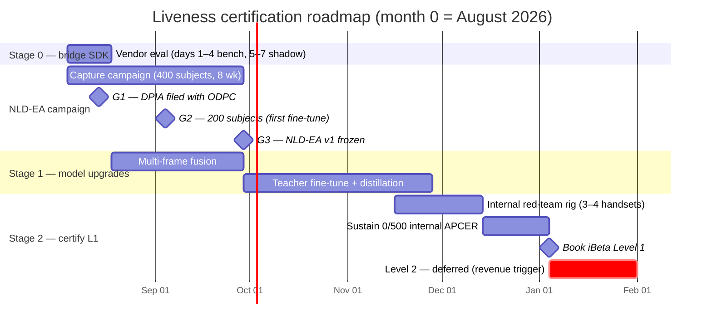
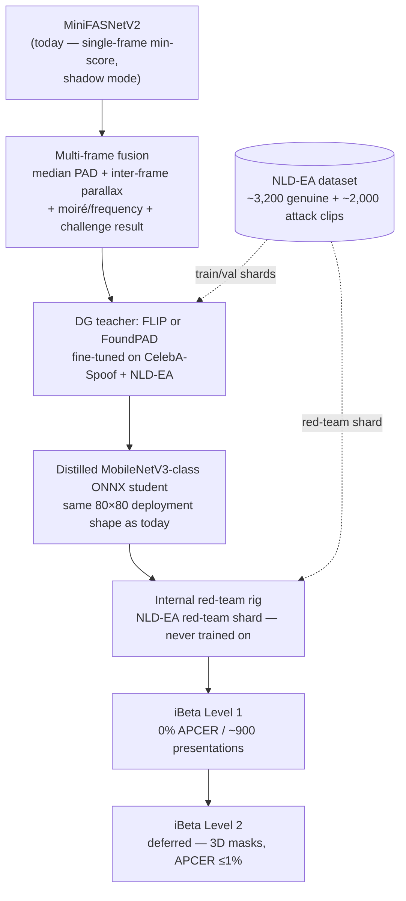

# Level-2 Upgrade Plan — Certified Liveness & the NLD-EA Data Campaign

*Part of the [Nemo eKYC technical documentation](README.md). 2026-08-01. This is the
execution roadmap that takes the in-house liveness stack described in docs 04–05 from
an uncertified shadow-mode scorer to iBeta ISO/IEC 30107-3 PAD certification. It
consolidates three planning documents — [docs/nemo/08-liveness-plan.md](../nemo/08-liveness-plan.md)
(tiers and the LivenessProvider seam), [docs/nemo/09-liveness-build-and-certify.md](../nemo/09-liveness-build-and-certify.md)
(open-model landscape, certification economics, staged plan), and
[docs/nemo/10-liveness-stage0-and-data-campaign.md](../nemo/10-liveness-stage0-and-data-campaign.md)
(Stage-0 execution and the NLD-EA dataset) — into one plan of record.*

---

## 1. Goal

Today the platform's passive PAD is a single MiniFASNetV2 ONNX model
(`ekyc-ml-service/engine/liveness.py`) running in shadow mode: it scores every selfie
set but decides nothing, because its training data skews East-Asian and its
false-reject behavior on darker skin tones and low light is unverified (doc 08's
calibration warning). The plan moves from that position to a certified, owned product
in three deliberate steps:

1. **Immediate (Stage 0)** — license an iBeta-Level-2-certified bridge SDK behind a
   `LivenessProvider` seam (planned in doc 08; the [audit](05-current-state-audit.md)
   confirms it must first be extracted from `inhouse.go`), so sales can truthfully
   claim "Level 2 certified liveness" within weeks, while the in-house stack keeps
   scoring 100% of traffic in shadow.
2. **Owned and certified (Stages 1–2)** — upgrade the in-house model via multi-frame
   fusion and a domain-generalization teacher→student pipeline trained on the NLD-EA
   dataset, then certify it at **iBeta Level 1** (~$25–40k, months 4–6).
3. **Level 2 when it pays for itself** — defer the L2 submission (3D mask attacks,
   +$30–50k) until liveness is revenue-attributable; the bridge SDK covers L2 claims
   in the interim. The end state is **"Nemo KYC"**: the full scan-first onboarding,
   OCR, face-match, screening, and liveness stack as a white-label per-check API,
   certified and calibrated on East African faces — a regional-calibration claim no
   incumbent vendor matches (doc 09 §4).

## 2. Staged timeline

The NLD-EA campaign runs concurrently with Stage 1: gate G2 (200 subjects at week 5)
deliberately triggers the first teacher fine-tune on half the data, so model work
never blocks on campaign completion.

## 3. Model-evolution pipeline

The student model ships in the exact deployment shape the service runs today — an
80×80 face-crop ONNX classifier behind `cv2.dnn` — so the swap is a model-file
drop-in, not a service rewrite.

## 4. Stage 0 — bridge SDK (weeks 1–2)

**Why.** Certification of the owned model is months away, but bank partners and
prospects ask for the iBeta letter *now*. A certified on-prem SDK mounted as a second
`LivenessProvider` implementation lets sales claim Level 2 immediately at a fixed
annual cost — explicitly **not** per-check SaaS, for both data-residency and
unit-economics reasons (doc 09 §3).

**Shortlist** (all hold current iBeta L2 confirmation letters):

| Vendor | Est. price | Form factor | Notes |
|---|---|---|---|
| MiniAiLive | ~$3–8k/yr | Linux/Docker on-prem | Primary candidate |
| KBY-AI | ~$2–6k/yr | Server + mobile SDKs | Primary candidate |
| Facia | quote | on-prem | Fallback if both fail gates |

**Evaluation protocol (2 weeks from receipt of eval builds):**

- **Days 1–4 — bench**: run each SDK against our held-out genuine/attack captures;
  measure APCER, BPCER, and latency on the production box CPU.
- **Days 5–7 — shadow**: side-by-side with `ekyc-ml` on staging; measure the
  disagreement rate against the in-house scorer.
- **In parallel — license diligence**: on-prem terms; **white-label/resale rights
  (REQUIRED — without them the SDK cannot back the Nemo KYC product)**; the iBeta
  letter must match the shipped SDK version; no phone-home telemetry.

**Decision gates**: APCER ≤1% on our attack set · BPCER ≤10% on our genuine set ·
price ceiling $8k/yr. Any failure → next vendor on the shortlist.

**Integration**: mounts behind the `LivenessProvider` seam
(`{frames} → {liveScore, decision, provider, auditRef}`) as a second registered
implementation. **Prerequisite**: the seam does not exist in code yet — liveness is
inlined in the `inhouse` eKYC provider; extracting it is ranked action 3 of the
[audit](05-current-state-audit.md#4-recommended-next-actions-ranked-feeding-doc-06). The in-house scorer stays on 100% of traffic in shadow regardless of
which provider decides. Ethiopia routes to VeriFayda 2 (national eKYC via EthSwitch)
behind the same seam either way (doc 08, regulatory notes).

## 5. NLD-EA — the East-African training-data campaign (weeks 1–8)

This is the centerpiece. MiniFASNet's documented East-Asian training skew — elevated
false-reject risk on darker skin tones and in low light — is exactly the failure mode
a Kenyan/Ethiopian deployment cannot tolerate. No open dataset fixes it, and no
vendor's marketing can claim what a model *trained on this data* can demonstrate.
**NLD-EA (Nemo Liveness Dataset, East Africa) is the moat**: the regional-calibration
claim behind Nemo KYC rests on it.

**Targets**: 400 consenting subjects → ~3,200 genuine clips + ~2,000 attack clips in
8 weeks, ≈ **$8.6k all-in**.

**Session protocol (~15 min/subject)**: 3 lighting stations (daylight >1,000 lux ·
office ~300 lux · dim <50 lux — dim deliberately over-sampled, it is MiniFASNet's
failure zone) × 2 devices × 2 takes = 12 genuine clips per subject, including a full
blink→turn→smile challenge run so training data matches production capture.

**Attack desk** — clips fabricated from each subject's own media, mapped to the iBeta
Level-1 attack repertoire:

| Attack species | Target clips |
|---|---|
| Matte print | 400 |
| Glossy print | 300 |
| Cutout mask | 300 |
| Phone-screen replay | 500 |
| Monitor replay | 300 |
| Challenge-replay | 200 |
| **Total** | **~2,000** |

**Demographic and device quotas**:

| Axis | Quota |
|---|---|
| Skin tone (Monk scale) | Full 1–10 coverage, **≥60% in 7–10** |
| Age | 45% 18–30 · 40% 31–50 · 15% 51+ |
| Gender | 50/50 ±5% |
| Device fleet | Actual Kenyan market: 2 budget (Tecno/Redmi) + 2 mid-range (Samsung A / Camon); model recorded per clip |
| Sites | Nairobi CBD + university + peri-urban; Addis pilot (50 subjects) weeks 7–8 |

**Compliance gate (G1 — hard gate, before any capture)**: DPIA filed with the ODPC
**before** the first session; tablet-signed plain-language consent covering purpose,
compensation, withdrawal-by-subject-ID with deletion, **36-month retention**,
encrypted on-prem storage, and anti-fraud-model-development-only use; minors
excluded. This is the binding Kenyan constraint (Data Protection Act — doc 08).

**Pipeline**: capture app (consent + session script) → encrypted on-prem store keyed
by erasable subject-ID → label sheet (genuine|attack·species, device, lux, station,
Monk tone) → **subject-disjoint train/val/red-team shards**. The red-team shard never
touches training and becomes the internal certification rig for Stage 2.

**Budget** (doc 10):

| Line item | Amount |
|---|---|
| Subject compensation (400 × KES 800) | $2,480 |
| Field agents | $2,400 |
| Devices | $900 |
| Capture kit (lighting, tripods) | $450 |
| Attack materials | $350 |
| Legal / DPIA counsel | $1,200 |
| Contingency | $780 |
| **Total** | **$8,560** |

**Gates**: G1 DPIA filed (week 2) · G2 200 subjects (week 5 — triggers the first
teacher fine-tune on half the data) · G3 NLD-EA v1 frozen (week 8).

## 6. Stage 1 — model upgrades (months 1–4)

Two upgrades, in this order, per doc 09 §3:

**1. Multi-frame fusion** (first — biggest APCER win per engineering hour, zero
licensing risk). Replace today's single-frame min-score decision with 10-frame
aggregation: median PAD score + inter-frame parallax + moiré/frequency features,
fused with the ML Kit challenge result into one decision score. The Tier-1 challenge
screen already captures multi-frame selfie sets, so the plumbing exists end-to-end —
this is scoring logic, not new capture infrastructure. It directly retires the
weakest-frame-decides behavior in `score_frames()` today.

**2. Domain-generalization teacher → distilled student.** Fine-tune **FLIP**
(CLIP-based, best published cross-dataset generalization of its generation) or
**FoundPAD** (2025, DINOv2+LoRA, built for unseen-domain generalization) on
CelebA-Spoof (625K images — **license check required first**) plus the NLD-EA
train shard, then distill to a MobileNetV3-class ONNX student in the exact 80×80
deployment shape. This is the step that kills MiniFASNet's skin-tone/lighting domain
gap — in the field and, critically, in the certification lab.

## 7. Stage 2 — certify Level 1 (months 4–6)

**What iBeta Level 1 actually takes** (doc 09 §2):

- ~900 presentations across 6 cheap attack species (print, replay, cutouts).
- Pass bar: **0% APCER** — zero spoofs may get through — with BPCER ≤15% (generous;
  aggressive spoof-averse thresholds plus retry-not-reject UX are legal).
- Tested **per app-build, per device** — the submitted build/device pairs are what
  the letter covers.
- Budget: realistic **$25–40k** (lab fee + one retest reserve + rig/devices);
  4–12 weeks elapsed. **Retests are normal and billed** — budget for one from the
  start. Get a competing quote from **BixeLab** before booking.

**Sequence**: build the internal red-team rig replicating the L1 attack repertoire on
3–4 handsets, driven by the NLD-EA red-team shard (subject-disjoint, never trained
on); book iBeta **only after sustaining 0/500 internal APCER**. Small teams
demonstrably pass — iBeta's letter list includes 2-to-10-person shops at both levels.

**Level 2 deferral logic**: L2 adds 3D attacks (silicone/latex/resin masks, APCER
≤1%) and roughly **+$30–50k** plus mask-fabrication skills. Trigger: **liveness
becomes revenue-attributable** (Nemo KYC per-check sales, or a contract naming L2 for
the in-house stack). Until then the Stage-0 bridge SDK legitimately covers L2 claims.

## 8. Business case — build vs buy

| | Buy (Smile ID-class) | Build + certify (this plan) |
|---|---|---|
| Cost model | $0.30–1.00 per check, forever | One-time ~$35k L1 + ~$8.6k data + bridge $2–8k/yr |
| Break-even | — | Low tens of thousands of checks |
| Data residency | Vendor cloud | Fully on-prem |
| Regional calibration | Generic | Trained on NLD-EA (East African faces, Kenyan device fleet) |
| Product upside | None (pure cost) | "Nemo KYC" white-label per-check API via the G2 platform |
| Skip condition | — | Only if liveness stays a pure internal checkbox — which the neobank-in-a-box strategy rules out |

Smile ID's traction proves regional demand for certified KYC APIs; no Chinese SDK
vendor matches the East-African calibration claim (doc 09 §4).

## 9. Decision log — pending founder decisions

| # | Decision | Blocks | Status |
|---|---|---|---|
| 1 | Send Stage-0 outreach emails (MiniAiLive + KBY-AI; drafts in the doc-10 artifact §1.4) | Stage-0 eval clock | Pending |
| 2 | Approve $8.6k NLD-EA budget + KES 800/subject compensation rate | Campaign start, gate G1 | Pending |
| 3 | Name counsel for the DPIA | Gate G1 (hard gate — no capture before filing) | Pending |

Everything technical for Stage 0 is ready on receipt of vendor eval builds (doc 10).

## 10. Risks & mitigations

| Risk | Impact | Mitigation |
|---|---|---|
| DPIA/ODPC delay or adverse finding on NLD-EA | Campaign blocked; Stage-1 fine-tune slips | G1 is a hard gate before capture; counsel engaged early ($1.2k budgeted); consent design (withdrawal, 36-month retention, purpose limitation) built into the capture app |
| CelebA-Spoof license unsuitable for commercial training | Teacher fine-tune loses its largest public corpus | License check scheduled before Stage-1 step 2; fallback is NLD-EA + other permissive PAD sets with a heavier NLD-EA weighting |
| MiniFASNet class-order assumption wrong for a given ONNX export | Live/attack classes swapped in shadow scores | Documented in `liveness.py` (index 1 = live per the reference repo); shadow-mode score distributions on real traffic will surface an inversion before enforcement |
| iBeta retest(s) required | +weeks and +$10k-class cost per retest | Budgeted explicitly ($25–40k includes a retest reserve); internal 0/500 APCER gate before booking; BixeLab competing quote |
| Bridge vendor diligence failure (telemetry, letter/SDK version mismatch, no resale rights) | L2 claim unsound; Nemo KYC white-label blocked | Diligence items are explicit Stage-0 gates: no telemetry, letter must match shipped version, white-label/resale rights required — any failure moves to the next shortlisted vendor |
| Field-capture quality drift (lux, labels, quotas) | Dataset undertrained in exactly the target domains | Per-clip metadata (device, lux, station, Monk tone), lighting-station protocol, G2 mid-campaign checkpoint at 200 subjects |

## 11. Sources

- [docs/nemo/08-liveness-plan.md](../nemo/08-liveness-plan.md) — tier design, MiniFASNet calibration warning, LivenessProvider seam, Kenya/Ethiopia regulatory notes.
- [docs/nemo/09-liveness-build-and-certify.md](../nemo/09-liveness-build-and-certify.md) — open-model landscape (FLIP, FoundPAD, CelebA-Spoof), certification economics, staged plan, business case, full external link list.
- [docs/nemo/10-liveness-stage0-and-data-campaign.md](../nemo/10-liveness-stage0-and-data-campaign.md) — Stage-0 shortlist and eval protocol, NLD-EA targets, protocol, quotas, budget, gates.
- `ekyc-ml-service/engine/liveness.py` — the current single-frame min-score implementation this plan upgrades.
