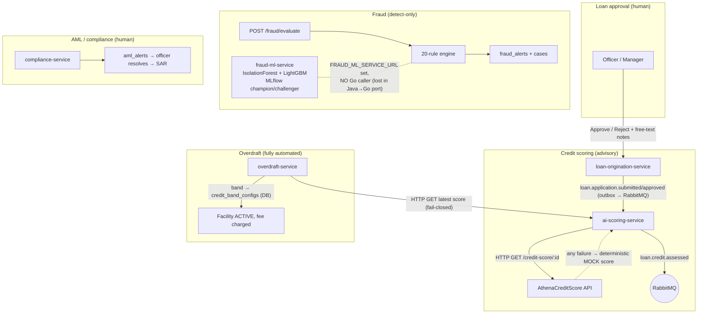
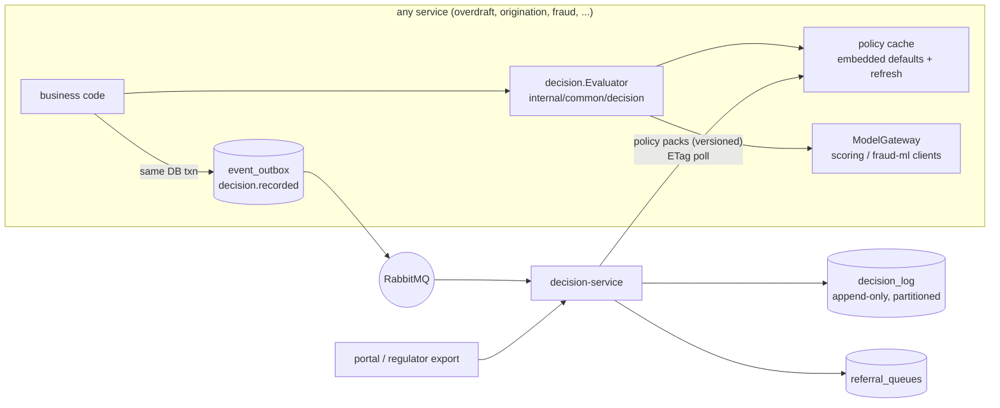

# Nemo — Unified Decision Engine (E1) Design

**Status:** design proposal · **Owner:** Platform / Risk · **Last updated:** 2026-07-17
· Closes the design step for **E1** in [02-gap-analysis-and-roadmap.md](02-gap-analysis-and-roadmap.md)
§E and Track 3 of [03-engineering-execution-plan.md](03-engineering-execution-plan.md).
Direct dependency of **E2** (straight-through credit + adverse-action reasons) and the
substrate for **E7** (model governance).

The claim we sell is "AI-operated bank". Today the platform makes automated decisions
in five uncoordinated places with five different logging stories, two different failure
philosophies, and zero customer-facing explanations. This document specifies the
**decision spine**: one policy layer every automated (and human) decision routes
through, with a versioned policy store, champion/challenger support, human-review
referral, and a decision log a regulator can audit without reading our code.

---

## 1. Current state — the five decision loci

Everything below is verified against the code as of this commit, not the marketing
copy.

### 1.1 Map



### 1.2 Path-by-path inventory

| Path | Trigger | Inputs | Decision + threshold source | Human in loop | Log |
|------|---------|--------|-----------------------------|---------------|-----|
| **Credit scoring** (`internal/scoring`) | `loan.application.submitted` / `.approved` events (consumer binds both) | customerId only; features live inside the external AthenaCreditScore API | *None* — advisory. Bands A–D and PD are computed **outside the platform** (or by the mock) | n/a | `scoring_requests` / `scoring_results` tables; free-text `reasoning` strings |
| **Loan approval** (`internal/origination`) | Officer clicks Approve/Reject | Whatever the officer looked at; `ApproveApplicationRequest` lets the human **type in** `creditScore`/`riskGrade` | Human judgment; maker-checker SoD enforced (`loanSoDRequired`) | 100 % | `application_status_history` + audit record; rejection reason = free text |
| **Overdraft facility** (`internal/overdraft/service/wallet.go ApplyOverdraft`) | Customer applies | Latest **stored** score from scoring service (sync HTTP, fail-closed per HIGH-6) | Fully automated: band → `credit_band_configs` row (per-tenant, `system` fallback) → limit/rate/fee, facility ACTIVE | 0 % — no referral tier exists | Audit entry with score/band/limit; no reasons to customer |
| **Fraud** (`internal/fraud/engine`) | `POST /api/v1/fraud/evaluate` **only** — no event consumer; nothing on money paths calls it | Event type, amount, KYC status, velocity counters, watchlists | 20 rules; per-tenant params in `fraud_rules` JSONB (good), but **defaults hardcoded** in `paramFloat` fallbacks; severity weights, EMA blend (0.7/0.3, 0.4/0.6) and risk-level cut-offs (0.2/0.4/0.7) hardcoded in `engine.go` | Alerts → case management (human), but the engine **cannot act**: `fraud.block.account` is defined in `event_types.go` and never published | `fraud_events`, `fraud_alerts`, risk profiles |
| **AML/compliance** (`internal/compliance`) | API calls + event logging | Alert payloads | None automated — alert CRUD, human resolution, SAR filing | 100 % | `aml_alerts`, `compliance_events`, `sar_filings` |

### 1.3 The gaps, concretely

1. **No unified decision log.** A regulator asking "show me every automated credit
   decision for tenant X in March, with inputs and reasons" requires joining four
   schemas across four databases, and still can't answer "which policy version
   decided this".
2. **Fail-open credit scoring.** `internal/scoring/client/external.go` falls back to
   a **deterministic mock score** on *any* failure (transport, non-2xx, decode) and
   persists it as a real `ScoringResult`, publishing `loan.credit.assessed`. The
   overdraft service then consumes that score **as if real** through its own
   correctly fail-closed client (`internal/overdraft/client/scoring.go`, HIGH-6).
   The fail-closed discipline of the money path is silently defeated one hop
   upstream. This is an F27-class inconsistency and the decision spine must
   make it structurally impossible.
3. **No explanations.** Score `reasoning` is free-text LLM/mock strings; overdraft
   declines say "Credit scoring is unavailable"; origination rejections are officer
   free text. Nothing maps to adverse-action reason codes (E2 blocker).
4. **Thresholds scattered.** Score-band cut-offs live in an external service *and*
   its mock; overdraft limits in `credit_band_configs`; fraud rule defaults in
   Go constants; severity weights and risk-level bands in code. No versioning, no
   approval workflow, no per-market variation, no "what changed when".
5. **Champion/challenger exists only in the orphaned sidecar.** `fraud-ml-service`
   has an MLflow registry with champion/challenger aliases, drift-oriented metrics
   and a feedback scheduler — and **no caller**: `FRAUD_ML_SERVICE_URL` is injected
   in both compose files but referenced by zero Go code; `scoring_history` and
   `Repository.CreateScoringHistory` exist unused. The Java client died in the port.
6. **Binary automation.** Overdraft is 100 % machine, origination is 100 % human.
   There is no policy-driven middle: "auto-approve in-policy, refer borderline,
   auto-decline hard fails" — which is exactly what E2 requires.
7. **No model metadata on decisions.** `LlmProvider`/`LlmModel` strings are stored
   on scoring results, but nothing records *which registered model version* touched
   a decision, so E7's kill-switch/drift story has nothing to attach to.

---

## 2. Target architecture v1

### 2.1 Shape: embedded library + thin control-plane service

**Decision: evaluation is a library (`internal/common/decision`) linked into each
service; policy management, referral queues and the unified log projection live in a
new small `decision-service`.** Every decision is recorded as a `decision.recorded`
event through the producer's existing transactional outbox; `decision-service`
consumes these into the queryable `decision_log`.

Why not each alternative:

| Option | Verdict | Reason |
|--------|---------|--------|
| **Standalone decision-service on the request path** | Rejected for evaluation | Adds a synchronous network hop + new failure mode to money paths that are deliberately fail-closed (overdraft apply, disburse). An outage would either block credit issuance platform-wide or tempt callers into local fallbacks — recreating gap §1.3-2. Latency budget on transfers/draws is single-digit ms; we won't spend it on an RPC that evaluates a few comparisons. |
| **Library only, no service** | Rejected for control plane | Policy CRUD/versioning/approval, referral queues and the regulator-facing query API need one owner and one database. Sixteen copies of a policy admin API is not a product. |
| **Library + control-plane service (chosen)** | ✓ | Matches existing platform idioms exactly: `common/market` (config-as-data loaded in-process, embedded defaults), `common/outbox` (async, lossless emission), `common/idempotency` (consumer-side guard). One Go module means the library is a zero-cost import for all 16 services. |

Evaluation is therefore **in-process and broker-independent**; recording is
**asynchronous and lossless** (outbox → at-least-once → idempotent projection on
`event.id`, the same contract as every other consumer per
[EDA_HARDENING.md](../EDA_HARDENING.md) §2.2).



### 2.2 Policy definitions

A **policy** is data, not code — the same move as market packs (C2). YAML documents,
versioned, stored in `decision-service`'s DB with an approval workflow (maker-checker
already exists as a platform idiom), distributed to services via a cached
`GET /api/v1/policies/{tenant}` with ETag polling (60 s default), with **embedded
compiled-in defaults** so a cold service with no decision-service reachable still
evaluates deterministically — exactly how `common/market` ships the `KE` pack.

Resolution order: `tenant+market override → tenant → market default → platform
default`. Every resolved evaluation records the **policy id, semantic version and
content hash** it used.

```yaml
# policy: overdraft.facility  (illustrative)
policy: overdraft.facility
version: 3                       # monotonically increasing per policy id
market: KE                       # or "*"
tenant: "*"                      # or a tenant id
models:
  credit_score:
    source: ai-scoring-service   # via ModelGateway
    required: true               # unavailable model ⇒ on_model_unavailable
    max_age: 30d                 # stale score ⇒ refer, don't silently reuse
on_model_unavailable: DECLINE    # fail-closed, now declared not implied
rules:
  - id: OD-KYC
    when: "kyc_status != 'PASSED'"
    outcome: DECLINE
    reason: KYC_INCOMPLETE
  - id: OD-BAND
    table:                       # replaces credit_band_configs thresholds
      - { band: A, limit: 50000, rate: 12.5, fee: 500, outcome: APPROVE }
      - { band: B, limit: 20000, rate: 15.0, fee: 500, outcome: APPROVE }
      - { band: C, limit: 5000,  rate: 18.0, fee: 300, outcome: REFER }   # human tier
      - { band: D, outcome: DECLINE, reason: SCORE_BAND_LOW }
challenger:
  version: 4                     # evaluated in shadow on a % of traffic
  traffic: 0.10                  # deterministic hash(subject_id) bucketing
  mode: shadow                   # v1: log-only, never enforced
```

The v1 rule language is deliberately small: comparisons, band tables, and set
membership over a flat `Inputs` map — enough to express every threshold found in
§1.2. It is **not** a general expression engine; anything the language can't express
stays in Go behind a named rule id so it still logs and versions. (Explicitly not
choosing CEL/OPA in v1: a dependency and a sandboxing story we don't need for band
tables; revisit when policies outgrow the schema.)

### 2.3 Evaluation flow

```go
// internal/common/decision (signature sketch — not v1 code)
type Request struct {
    Type        string            // "overdraft.facility", "loan.application", "fraud.disposition"
    TenantID    string
    SubjectType string; SubjectID string; CustomerID string
    Actor       Actor             // SYSTEM, or the human user id for recorded manual decisions
    Inputs      map[string]any    // full feature snapshot — persisted verbatim
}
type Outcome struct {
    Decision  string              // APPROVE | DECLINE | REFER | FLAG | NO_ACTION
    Detail    map[string]any      // limit, rate, fee, band, queue ...
    Reasons   []Reason            // ordered, machine-coded (§3)
    Policy    PolicyRef           // id, version, hash
    Models    []ModelRef          // §4
    Variant   string              // champion | challenger:<v>
    LatencyMS float64
}
func (e *Evaluator) Evaluate(ctx, Request) (Outcome, error)
```

Contract points:

- **Every** call produces exactly one `decision.recorded` event, including `REFER`,
  `DECLINE`, and *human* decisions (origination Approve/Reject wraps the officer's
  action in a `Request{Actor: HUMAN}` so the log is complete, not just the ML half).
- The caller writes the event through **its own outbox in the same DB transaction as
  the state change** the decision caused. A facility can never exist without its
  decision record, and vice-versa — the F27 lesson applied to decisions.
- `REFER` outcomes additionally carry a queue name; decision-service materialises
  the referral item; the review verdict comes back as a second, linked
  `decision.recorded` (actor = human, `parent_decision_id` set). Referral queues
  unify with what exists: fraud case management and origination's UNDER_REVIEW state
  become consumers of the same queue API over time.
- Champion/challenger: the evaluator hash-buckets `subject_id`, evaluates the
  challenger version **in shadow** (outcome logged with `variant: challenger:v4`,
  never returned to the caller in v1), giving uplift analysis for free from the log.

### 2.4 Decision log schema

Owned by decision-service; append-only projection of `decision.recorded`, idempotent
on `event_id`; monthly partitions; retention ≥ 7 years (regulatory), vs the outbox's
14 days. Aligns with the tamper-evident accounting audit trail; hash-chaining the
log is deferred to v2 (§7).

| column | type | notes |
|--------|------|-------|
| `id` | uuid pk | = event id (idempotency key) |
| `tenant_id` | text | indexed; every regulator query starts here |
| `decision_type` | text | `overdraft.facility`, `loan.application`, `fraud.disposition`, `aml.triage` |
| `subject_type` / `subject_id` | text | wallet, application, transaction, alert |
| `customer_id` | text | nullable (some subjects aren't customers) |
| `actor_type` / `actor_id` | text | `SYSTEM` \| `HUMAN`; user id when human |
| `policy_id` / `policy_version` / `policy_hash` | text/int/text | exact policy that decided |
| `inputs` | jsonb | full feature snapshot at decision time, verbatim |
| `outcome` | text | APPROVE / DECLINE / REFER / FLAG / NO_ACTION |
| `outcome_detail` | jsonb | limit, rate, band, queue, ... |
| `reasons` | jsonb | ordered `[{code, ruleId, detail}]` — §3 |
| `models` | jsonb | `[{name, version, registryRef, role, score, latencyMs, available}]` — §4 |
| `variant` | text | `champion` \| `challenger:<version>` \| `shadow` |
| `parent_decision_id` | uuid | links human review verdict to the referral |
| `latency_ms` | numeric | end-to-end evaluate latency |
| `correlation_id` | text | joins to the domain event stream |
| `decided_at` / `recorded_at` | timestamptz | decision time vs projection time |

This answers the regulator's who/what/inputs/policy/outcome/why/how-fast in one
`SELECT`, and powers three products at once: the audit export, the
champion/challenger report, and E7's drift feed.

---

## 3. Explainability — adverse-action reason codes (E2)

Three layers, so machine codes stay stable while wording localises:

1. **Rule → code.** Every policy rule that can produce DECLINE/REFER carries a
   stable, market-neutral reason code from a platform registry
   (`internal/common/decision/reasons.go`): `SCORE_BAND_LOW`, `KYC_INCOMPLETE`,
   `SCORE_STALE`, `EXPOSURE_LIMIT`, `WATCHLIST_HIT`, `MODEL_UNAVAILABLE`, ...
   Codes are append-only; meanings never mutate (same discipline as event
   versioning in EDA_HARDENING §1.2).
2. **Score → codes.** For model-driven declines, the ModelGateway contract (§4)
   requires the scoring source to return **feature attributions** (top-k negative
   contributors), which the policy maps to codes via a `reason_map` in the policy
   pack (e.g. `crb_contribution < 0 → BUREAU_HISTORY`). The current external-API
   free-text `reasoning` is stored in `inputs` for the file but is *not* the
   customer explanation. Until the scoring API exposes attributions, band-level
   codes apply (`SCORE_BAND_LOW` + band detail) — honest, regulator-acceptable,
   and upgradeable without schema change.
3. **Code → words.** Customer-facing text is **market-pack content**: a
   `reasons/<code>.<locale>` catalogue alongside the existing pack fields
   (`internal/common/market`, `packs/ke.yaml`), rendered per tenant/brand by the
   notification service's templating (A5). The decline API response and the app
   surface `reasons[].code` + localized text; SMS/letter generation for markets
   that mandate written adverse action (ECOA-style) is a notification template.

Ordering matters and is preserved: `reasons[0]` is the principal reason, as most
adverse-action regimes require.

---

## 4. Model governance hooks (E7)

E7 starts here as **metadata + conventions inside E1**, growing into a service later
(per Track 3's staging).

- **ModelGateway.** All model calls from evaluators go through
  `internal/common/decision.ModelGateway` — a thin interface the existing clients
  (`overdraft/client/scoring.go`, a restored `fraud/client/ml.go`) implement. It
  stamps every response with `{name, version, registryRef, role, latencyMs,
  available}` and that block lands verbatim in `decision_log.models`. The fraud
  sidecar already runs an MLflow registry with champion/challenger aliases —
  `registryRef` is its model URI; the credit-score API gets a version header
  requirement in its integration contract (mock fallback removal, §5 inc-2).
- **Kill switches.** Policy packs declare model dependencies (§2.2) with an explicit
  `on_model_unavailable` outcome per policy. Disabling a model is a **policy
  operation** (`models.<name>.enabled: false`, new version, normal approval flow —
  auditable), plus an emergency env override (`DECISION_MODEL_DISABLE=<name>`) for
  incident response. A disabled/unavailable model triggers the declared fallback:
  rules-only band table, REFER-everything, or DECLINE — never a fabricated score.
  This deletes the mock-score fail-open by construction.
- **Drift feeds.** `decision.recorded` is the feed. v1 ships Prometheus series from
  the library (`decision_outcomes_total{type,outcome,variant}`,
  `decision_model_score` histograms per model/version, `decision_latency_ms`) via
  the existing `common/metrics` `/metrics` plumbing (H2), so score-distribution and
  approval-rate drift alert through the standard Alertmanager pack. Statistical
  drift jobs (PSI/KS against training baselines) consume the decision log in the
  E7 build-out; the sidecar's `feedback/loop.py` scheduler is the natural first
  home.
- **Champion/challenger governance.** Variant assignment and both outcomes are in
  the log, so promotion decisions ("challenger v4 approves 3 % more with equal
  30-day default rate") are queries, not vibes — and the promotion itself is a
  policy version bump with an audit trail.

---

## 5. Migration plan — adopting the spine without touching money-path stability

Ordering principle: **shadow before enforce, one call site per increment, overdraft
first** (single self-contained automated decision), origination second (E2 payoff),
fraud third (largest surface). Every increment ends tests-green and independently
shippable. Estimates are engineer-weeks, same convention as the 04 audit.

| Inc | Scope | Effort |
|-----|-------|--------|
| **1 — Spine + overdraft (shadow→enforce)** | `internal/common/decision` library (types, evaluator, reason registry, policy loader with embedded defaults, metrics); `decision.recorded` event type + topology binding; `decision_log` migration + projection consumer (hosted **in decision-service skeleton**, HTTP read API only); wrap `ApplyOverdraft`: evaluate in **shadow** (log-only, existing band-config path still decides), diff shadow vs actual in metrics for a soak week, then flip enforcement — band table moves into the `overdraft.facility` policy, `credit_band_configs` becomes the frozen fallback. Fail-closed semantics preserved and now declared in the policy. | **3 w** |
| **2 — Credit / origination (E2 enablement)** | Scoring results logged as decision inputs; **remove the mock-score fail-open** from `scoring/client/external.go` (mock allowed only behind an explicit `SCORING_SANDBOX=true`, refused in prod config); `loan.application` policy with APPROVE/REFER/DECLINE tiers — in-policy cases auto-decide (straight-through), REFER lands in today's UNDER_REVIEW flow unchanged; officer Approve/Reject recorded as human decisions with mandatory reason codes (free text becomes `detail`); adverse-action codes v1 + `reasons/*` catalogue in the KE market pack. Maker-checker SoD untouched. | **2–3 w** |
| **3 — Fraud + ML sidecar restoration** | Fraud engine emits `fraud.disposition` decisions (rule hits = inputs, disposition = outcome); hardcoded severity weights/risk cut-offs move into a `fraud.disposition` policy; **restore the sidecar integration** as a ModelGateway client (`score/combined`, populating the unused `scoring_history` path or retiring it in favour of `decision_log.models`); sidecar champion/challenger surfaces in the log; `fraud.block.account` finally gets a publisher — behind a policy outcome (`BLOCK`) that ships in shadow/FLAG mode first. Referral queue API in decision-service; fraud cases enrol as the first queue. | **3 w** |
| **4 — Control plane** | Policy CRUD/versioning/approval (maker-checker) in decision-service + minimal portal screens (policy diff view, referral queue, decision search); regulator export (CSV/JSON per tenant + date range); AML triage decisions logged (compliance alert dispositions enter the spine); ETag policy distribution replaces embedded-defaults-only mode. | **2 w** |

Total ≈ **10–11 engineer-weeks**, parallelisable after increment 1 (the library API
is the only shared dependency). Rollback story per increment: enforcement flips are
config (`DECISION_ENFORCE_<TYPE>=false` reverts to legacy path while still shadow-
logging), so no increment can strand a money path.

---

## 6. v1 cut line — what the first PR implements

Exactly increment 1, shadow stage:

1. `internal/common/decision`: `Request`/`Outcome`/`Reason`/`PolicyRef`/`ModelRef`
   types, band-table + comparison evaluator, reason-code registry, policy loader
   with embedded YAML defaults (`policies/overdraft.facility.ke.yaml`), Prometheus
   metrics.
2. `decision.recorded` in `common/event/event_types.go` + topology binding
   (`decision.#`).
3. decision-service skeleton (standard `cmd/` + `internal/` layout, port 28xxx):
   projection consumer (idempotent on event id) + `decision_log` migration +
   `GET /api/v1/decisions` (tenant-scoped, filterable, paginated).
4. `ApplyOverdraft` calls `Evaluate` in **shadow** and writes `decision.recorded`
   through the overdraft outbox in the same transaction as facility creation;
   behaviour of the money path is byte-for-byte unchanged.
5. Tests: library unit tests (band edges, resolution order, hash bucketing
   determinism), projection idempotency test, pytest API test asserting a decision
   record exists after an overdraft application.

**Explicitly not in v1:** enforcement flip (config-gated, after soak), challenger
*enforcement* (shadow only until the E7 review exists), policy CRUD UI, CEL-style
expressions, hash-chained log, drift statistics jobs, AML/fraud adoption,
straight-through credit (increment 2, tracked as E2).

---

## 7. Open questions

1. **Log integrity:** hash-chain `decision_log` like the accounting audit trail, or
   rely on append-only + DB privileges until a regulator asks? (Leaning: v2, cheap
   to add since records are immutable.)
2. **Credit-score attributions:** the AthenaCreditScore API contract needs a
   feature-attribution field for §3-layer-2; until then band-level reasons stand.
   Owner: scoring integration work in increment 2.
3. **Referral SLAs:** regulatory clocks on referred decisions (complaint-style
   timelines, A6/H6 overlap) — queue schema reserves `due_at` but policy semantics
   are undecided.
4. **Per-tenant policy authority:** can tenant admins edit policies directly, or
   only via our ops (C1 provisioning ships defaults)? Affects the approval-workflow
   depth in increment 4.
